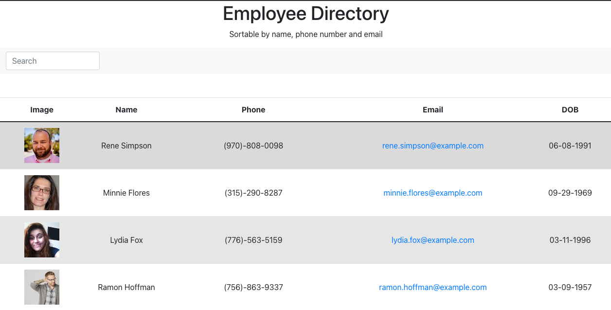

   

# 
 **Employee-Directory** 

--- 

--- 

## **Table Of Contents** 

---

1. [Description](#description)
2. [Installation](#installation)
3. [Usage](#usage)
4. [Contributing](#contributing)
6. [Review and Contribute](#github)
--- 

## 
  **Description** 
 

--- 

  This is an employee directory built with react.  The UI is broken into components, state management, and responds to user events.

--- 
 
## 
  **Installation** 

--- 
 
_The app deployment is linked below._
 <ol> <li>To install locally you will need to clone the repo and run npm i to install all dependencies.
 </li>
  <li> Next, input npm start in the command line in order to open the dev server and view the app in the browser with the localhost:3000.
  </li>
</ol>

--- 

## 
  **Usage** 

--- 

_There are a few interactive portions to this application._
<ul> 
   <li>
      Starting from the top the user will be able to narrow the return by searching with the name field.
   </li> 
   <li>
      The return is reduced dynamically as the user enters more characters.
   </li>
   <li>
      The columns themselves are also interactive and resort upon clicking them.
   </li>
   <li>
      They are initially sorted in ascending order by name.
  </li>
   <li>
      If the fields are clicked they will return the reverse sort in descending order.
   </li>
</ul>

--- 

## 
  **Contributing** 

--- 

The license is attached if you are interested in contributing the github and my information are provided at the bottom.

--- 

## 
  **Github and Email** 

--- 

## 
 **Review and contribute here**

### _Github:_ [Employee-Directory](https://github.com/cmgson/Employee-Directory)

### _Deployed App:_ [cmgson.github.io/Employee-Directory](https://cmgson.github.io/Employee-Directory/)

### _Email:_ cmgson1@gmail.com

--- 
